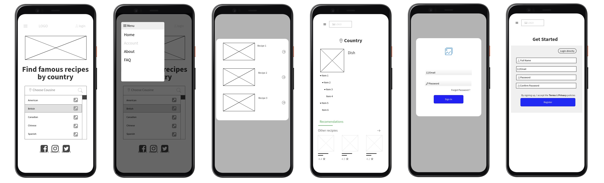

# Food Hunter

Curious to know what other people eat in different countries in the world? Go ***Food Hunting*** in the available countries we have and we will suggest easy to follow recipes that you can make for yourself. So pick your country, your favorite recipe and time to cook!


## MVP (DOM - CANVAS)

The __MVP__ will cover the following:

- __Homepage:__ The homepage will present the apps concept and features and provide links to the rest of the site.
- __Cousine:__ A user will be able to search the recipe database by selecting the ingredients they have in their kitchen.
- __FAQ:__ Everything you always wanted to know about ***Food Hunter?*** but were too afraid to ask.
- __Signup:__ A registration form for new users.
- __Login:__ A sign in form for existing users.


## Backlog    
- To find local restaurant of selected typical food 
- Dishes's nutritional information.

## Wireframes    




## Data Structure ##
- **root/**
     - index.html
     - cousine.html
     - faq.html
     - register.html
     - signin.html
     - **css/**
          - style.css
     - **js/**
          - main.js
          - Signup.js
          - User.js
          - Validator.js
          - spoonacularApi.js
     - **assets/**
          - img/
          - fonts/


## Data structure
Classes and methods definition


## APIs
The API(s) you are using


## Links


### Trello (list of tasks)
[Trello Board](https://trello.com/b/lRUn9X2z/food-hunter)


### Github
URls for the project repo and deploy
[Link Repo](http://github.com)
[Link Deploy](http://github.com)


### Slides
URls for the project presentation (slides)
[Link Slides.com](http://slides.com)

### Spoonacular
[API Description](https://spoonacular.com/application/frontend/downloads/spoonacular-api-slides.pdf)

[API Documentation](https://spoonacular.com/food-api/docs)

```

```